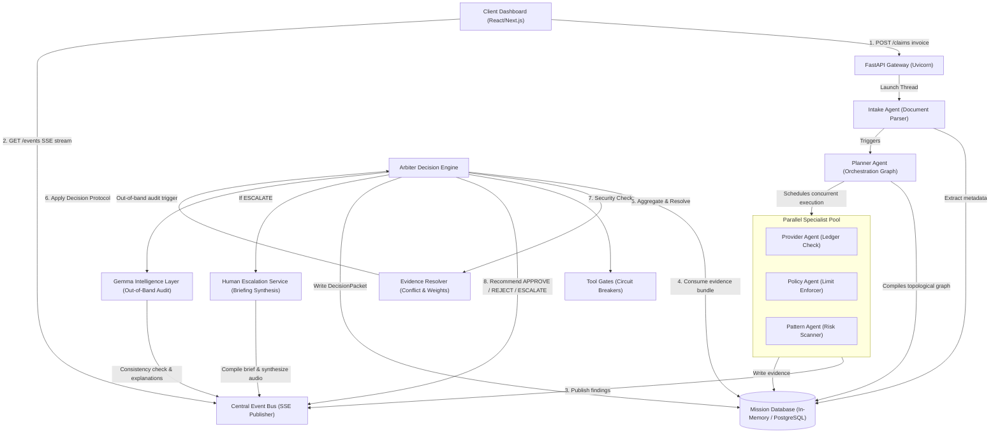

# Nexus AI Operations Platform

> **The Multi-Agent Orchestration & Decision Intelligence Engine for Autonomous Claim Adjudication.**

Welcome to the **Nexus AI Operations Platform**, a state-of-the-art enterprise-grade multi-agent platform designed to automate, audit, and optimize complex claims processing. Powered by **Google Gemini** models and independent **Gemma** intelligence layers, Nexus AI translates raw invoice documents into deterministic adjudications through a coordinated, parallelized, and highly explainable multi-agent system.

---

## 🏛️ System Architecture

The Nexus AI platform is engineered using a **Stateless Event-Driven Decoupled Architecture**. Claims undergo multi-stage topological orchestration while publishing real-time telemetry back to the client via Server-Sent Events (SSE).



### 🔁 Execution Pipeline Flow
1. **Ingestion**: The client uploads an invoice to `POST /claims`. The gateway enforces strict size (5MB), MIME types (PDF, PNG, JPEG), and sanitizes filenames.
2. **Streaming Event Connection**: The client initiates an asynchronous `GET /claims/{mission_id}/events` SSE streaming connection to capture real-time pipeline status updates.
3. **Parsing**: The **Intake Agent** parses invoice texts, structures metadata parameters, and stores initial payloads in the Mission Database.
4. **Planning**: The **Planner Agent** compiles a dynamic, customized execution graph using Gemini, determining which specialist agents are required to address this specific claim type.
5. **Parallel Validation**: A multi-threaded **WorkflowExecutor** dispatches required specialists:
   - **Provider Agent**: Connects to registries (via MCP tool connectors) to verify credentials.
   - **Policy Agent**: Scans company rules to verify limits, dental/medical codes, and procedural constraints.
   - **Pattern Agent**: Runs behavioral historical checks to detect duplicate billings or split-billing fraud alerts.
6. **Consensus Arbitration**: The **Arbiter Decision Engine** consumes the aggregated evidence bundle. It executes logical conflict resolutions (applying credibility weights), evaluates deterministic guardrails, runs Human-Owned **Tool Gates** (circuit breakers), and recommends an outcome (`APPROVE`, `REJECT`, or `ESCALATE`).
7. **Human Escalation**: If escalated, the **Human Escalation Service** compiles an executive brief, formats reviewer questionnaires, and synthesizes a spoken `.wav` audio briefing using **Gemini 3.1 Flash Text-to-Speech**.
8. **Independent Audit**: In parallel, the **Gemma Intelligence Layer** performs an out-of-band consistency check to audit the Arbiter's reasoning, providing human-friendly summaries to build absolute operational trust.

---

## 🧾 Live Demo Claim Receipts

The repository includes pre-built clinical receipts located in the [assets/](file:///Users/kiruthick/Developer/nexusAI/assets) directory. These are fully prepared for drag-and-drop ingestion testing in the **Live** and **Mock** simulation dashboard:

1. **✅ Valid Claim (`assets/valid_claim.png`)**
   - **Type**: Clean out-of-network clinical receipt.
   - **Details**: Issued by *Apollo Clinics* for patient *Kiruthick S.*, dated *September 24, 2026*. It details specialist consultations, standard clinical ECG diagnostics, and pharmacy dispersion totaling **$400.00** (after adjustments).
   - **Topological Flow**: Evaluates clean registry status ➔ executes standard coverage checks ➔ passes audit checks ➔ completes auto-approval guidelines.

2. **⚠️ Invalid Claim (`assets/Invalid_claim.png`)**
   - **Type**: Generic non-cohesive nature image.
   - **Details**: A scenic landscape image containing no textual elements, structured metadata, or clinic headers.
   - **Topological Flow**: The *Intake Agent* performs OCR/vision processing ➔ fails to identify logical receipt bounds or structures ➔ triggers immediate safety/compliance flags ➔ escalates cleanly to the **Human Intervention Queue** to safeguard pipeline operational integrity.

---

## 🎮 How to Run Mock Demo Simulations

To guarantee a bulletproof, high-fidelity presentation flow during live pitch decks or in offline environments, the Nexus AI frontend comes pre-packaged with a local **Mock Simulation Engine**:

1. **Toggle Mock Mode**: At the top right of the navigation header, you will see a mode switcher. Click the **"Mock Simulation"** button. This will switch the workspace context state and display an `ENV: MOCK` status badge.
2. **Select or Upload any File**: Under the central drop-zone panel, drag-and-drop any mock image, or simply click inside the box to trigger ingestion.
3. **High-Fidelity Pipeline Execution**:
   - The dashboard will immediately launch a full **asynchronous timeline simulation**.
   - You will see the progress indicators tick upward sequentially as the **Planner Agent**, **Provider Agent**, **Policy Agent**, and **Pattern Agent** output their findings in real-time.
   - The *Arbiter Decision Engine* card will update dynamically, rendering live reasoning logs, consensus weights, and conflict resolution indicators.
   - If a manual review is triggered (as in the case of out-of-network conflicts), the **Human Intervention Queue** will activate, rendering reviewer questionnaires and allowing you to click approve/deny directly to see immediate state reactions.
4. **Seamless Transition back to Live Server**: To switch to live parsing, simply toggle the header switch back to **"Live Server"** (showing `ENV: LIVE`). All file ingestion will now trigger real-time Gemini processing and Server-Sent Event streams!

---

## 🛠️ Technology Stack

### Backend
- **Framework**: FastAPI (Python 3.12)
- **Agent Framework**: Google GenAI SDK (Gemini 2.5 Pro / 3.5 Flash)
- **Audio & TTS Engine**: Gemini 3.1 Flash TTS Preview
- **Verification Engine**: Pydantic V2 (Strict Schema Mapping)
- **Testing Suite**: Pytest (Headless integration testing)

### Frontend
- **Framework**: Next.js 15 (App Router)
- **Styling**: Tailwind CSS & Vanilla HSL CSS variables
- **State Store**: Zustand (Global event subscriber)
- **Transitions**: Framer Motion & Lucide Icons

### Infrastructure & Deployment
- **Deployment target**: Google Cloud Run (Fully Serverless Container Orchestration)
- **Database**: Cloud SQL PostgreSQL & BigQuery (Offline simulation analytics)
- **Storage**: Cloud Storage (GCS)
- **Containment**: Docker Multi-stage builds & Docker Compose

---

## 📂 Repository Directory Layout

```text
nexusAI/
├── .agents/                    # Customization rules and agent parameters
├── backend/                    # Core Python FastAPI Backend
│   ├── app/
│   │   ├── arbiter/            # Centralized decision engines, aggregators, resolvers
│   │   ├── core/               # Configuration settings, logging, event bus systems
│   │   ├── escalation/         # Human escalation package compilation & TTS audio synthesis
│   │   ├── gemma/              # Out-of-band explanations, decision consistency, and auditer
│   │   ├── models/             # Shared Pydantic data schemas and enums
│   │   ├── workflow/           # Planner orchestration and multi-threaded executors
│   │   ├── gates.py            # Strictly Human-Owned Tool Gate execution blocks
│   │   └── main.py             # Server endpoints, routing, rate limiters, global handlers
│   ├── tests/                  # Complete unit and integration test suite
│   ├── Dockerfile              # Multi-stage production container asset
│   └── pyproject.toml          # Python dependencies & lock manifests
├── frontend/                   # React Next.js Dashboard Frontend
│   ├── src/
│   │   ├── components/         # Premium dashboard layout, widgets, and animation wrappers
│   │   ├── mock/               # Mock scenarios for standalone simulation playbacks
│   │   ├── store/              # Zustand global client-side state store
│   │   └── app/                # Next.js App Router entry pages
│   ├── package.json            # Node dependencies
│   └── FRONTEND.md             # High-level developer frontend document
├── docs/                       # Hackathon-grade system specifications
│   ├── ARCHITECTURE.md         # Extended technical design and GCP topologies
│   ├── DEMO_SCRIPT.md          # Live presentation scripts & playback narratives
│   └── JUDGE_QA.md             # Technical QA guides for DeepMind panels
├── docker-compose.yml          # Container configuration for local deployment
└── README.md                   # Master repository documentation (this file)
```

---

## 🚀 Getting Started

### 📋 Prerequisites
Ensure you have the following installed locally:
- **Docker** & **Docker Compose**
- **Node.js** (v18+)
- **Python** (v3.12)

---

### 🐳 Option A: Unified Local Deployment (Recommended)

To spin up both the FastAPI backend and the Next.js frontend concurrently using Docker Compose:

1. Create a `.env` file in the `backend` directory based on the provided template:
   ```bash
   cp backend/.env.example backend/.env
   ```
2. Configure your keys inside `backend/.env`:
   ```env
   GEMINI_API_KEY=your_actual_google_api_key_here
   GOOGLE_API_KEY=your_actual_google_api_key_here
   DEMO_MODE=true # Bypasses cloud service dependencies locally
   ```
3. Run Docker Compose from the root directory:
   ```bash
   docker compose up --build
   ```
4. Access the platforms:
   - **Interactive Frontend**: [http://localhost:3000](http://localhost:3000)
   - **Backend API Docs**: [http://localhost:8000/docs](http://localhost:8000/docs)

---

### 💻 Option B: Native Developer Startup

#### 1. Launch the Backend
```bash
cd backend
python3 -m venv .venv
source .venv/bin/activate
pip install -e . # Installs project & dependencies using uv
# Or with uv directly: uv pip install -e .

# Launch local server using Uvicorn
PORT=8000 DEMO_MODE=true uvicorn app.main:app --reload
```

#### 2. Launch the Frontend
```bash
cd frontend
npm install
npm run dev
```
Open [http://localhost:3000](http://localhost:3000) inside your browser.

---

## 🌐 Production Deployment Steps

### 1. ⚙️ Deploy Backend to Google Cloud Run
The Nexus AI FastAPI backend service can be easily compiled, packaged, and scaled on GCP Cloud Run. We provide an automated build script for this inside `backend/scripts/`:

1. Authenticate with Google Cloud SDK:
   ```bash
   gcloud auth login
   gcloud config set project your-gcp-project-id
   ```
2. Enable the required GCP cloud services:
   ```bash
   gcloud services enable run.googleapis.com artifactregistry.googleapis.com secretmanager.googleapis.com
   ```
3. Run the automated deployment helper:
   ```bash
   cd backend
   chmod +x scripts/deploy_cloud_run.sh
   ./scripts/deploy_cloud_run.sh
   ```
4. Capture the deployed **Service URL** output at the end (e.g. `https://nexus-backend-hash-uc.a.run.app`).

### 2. ⚡ Deploy Frontend to Google Cloud Run
The Next.js frontend is fully containerized and deployed serverlessly to **Google Cloud Run**, passing the live backend service endpoint as a build argument so it gets baked directly into the static client bundles.

1. Build the frontend docker image for `linux/amd64` architecture, passing the active backend URL as a build-time argument:
   ```bash
   cd frontend
   docker build --platform linux/amd64 \
     --build-arg NEXT_PUBLIC_API_URL="https://nexus-backend-311963508157.asia-south1.run.app" \
     -t gcr.io/deepmind-hack26blr-4071/nexus-frontend:latest .
   ```
2. Push the compiled image to your Google Container Registry:
   ```bash
   docker push gcr.io/deepmind-hack26blr-4071/nexus-frontend:latest
   ```
3. Deploy the frontend container to Cloud Run:
   ```bash
   gcloud run deploy nexus-frontend \
       --image gcr.io/deepmind-hack26blr-4071/nexus-frontend:latest \
       --region asia-south1 \
       --platform managed \
       --allow-unauthenticated \
       --memory 1Gi \
       --cpu 1 \
       --timeout 300 \
       --concurrency 80
   ```
4. Once deployed, Cloud Run will output your live frontend service URL (e.g. `https://nexus-frontend-311963508157.asia-south1.run.app`).

### 3. 🛡️ Secure CORS Alignment on the Backend
To configure strict, secure origin filtering:
- Re-deploy your backend Cloud Run instance, adding the `ALLOWED_ORIGINS` environment variable pointing specifically to your new frontend URL:
  ```bash
  --set-env-vars="ALLOWED_ORIGINS=https://nexus-frontend-311963508157.asia-south1.run.app"
  ```
  This immediately locks down the FastAPI gateway to only process trusted requests originating from your production dashboard!

---

## 🧪 Verifying Systems Health
Run the automated test suites using `pytest` inside the backend directory:
```bash
cd backend
source .venv/bin/activate
DEMO_MODE=true pytest tests/
```

For extended specifications, please refer to the detailed guides inside the [docs/](file:///Users/kiruthick/Developer/nexusAI/docs) directory:
- 🗺️ **Detailed Diagrams & Blueprint Spec**: See [docs/ARCHITECTURE.md](file:///Users/kiruthick/Developer/nexusAI/docs/ARCHITECTURE.md)
- 🎙️ **Demo Flow Scripting Guide**: See [docs/DEMO_SCRIPT.md](file:///Users/kiruthick/Developer/nexusAI/docs/DEMO_SCRIPT.md)
- 🧠 **Technical Judging Q&A Prep**: See [docs/JUDGE_QA.md](file:///Users/kiruthick/Developer/nexusAI/docs/JUDGE_QA.md)
