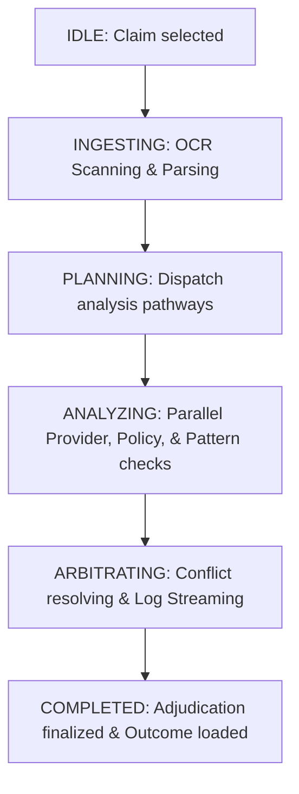

# 🌐 Server-Sent Events (SSE) Event Contracts
### *Single Source of Truth for Frontend-Backend Communication*

This document defines the strict event schema, lifecycles, and payload contracts for Server-Sent Events (SSE) streaming communication between the **Nexus AI Operations Platform** backend and frontend.

---

## 🔄 1. Lifecycle Workflows

### A. Mission Lifecycle
A "Mission" represents a single, complete execution run adjudicating an expense claim:
`IDLE` ➔ `INGESTING` ➔ `PLANNING` ➔ `ANALYZING` ➔ `ARBITRATING` ➔ `COMPLETED`



### B. Event Lifecycle
Events stream over SSE sequentially to report checkpoint transitions, status modifications, and monospaced console log streams:

1. **Workflow Initializing**: `workflow_started`
2. **Document OCR Intake**: `intake_started` ➔ `extraction_completed`
3. **Planner Setup & Routing**: `planner_started` ➔ `planner_dispatch`
4. **Parallel Agent Execution**:
   - *Provider*: `provider_started` ➔ `provider_completed`
   - *Policy Check*: `policy_started` ➔ `policy_completed`
   - *Pattern Check*: `pattern_started` ➔ `pattern_completed`
5. **Conflict Resolution & Arbitration**: `conflict_detected` ➔ `arbiter_started` ➔ `arbiter_completed`
6. **Guardrails & Gates**: `gate_check` ➔ `human_required`
7. **Conclusion & Output**: `decision` ➔ `workflow_completed`

---

## 📡 2. Server-Sent Events (SSE) Stream Format

All SSE packets must comply with the HTML5 event-stream standard. Messages are streamed on UTF-8 text connections, utilizing double-newline delimiters:

```http
event: message
data: {"event_id": "893fa912-429a-4c22-9214-e0c406cb46f0", "event_type": "workflow_started", "timestamp": "2026-07-11T12:00:00Z", "mission_id": "RUN-9012", "step": "INGESTING", "severity": "INFO", "payload": {}}

event: message
data: {"event_id": "ab82cc1d-91aa-4621-8311-bf10cbbd1421", "event_type": "intake_started", "timestamp": "2026-07-11T12:00:01.250Z", "mission_id": "RUN-9012", "step": "INGESTING", "severity": "INFO", "payload": {"file_name": "med_invoice_41.pdf", "file_size": "1.4 MB"}}
```

---

## 🏷️ 3. Enumerated Values Boundaries

### A. AI Agent Names
- `PlannerAgent`: The central router dispatcher.
- `ProviderAgent`: Validates provider credentials, GSTIN registration, and license scopes.
- `PolicyAgent`: Compares claims against insurance guidelines or enterprise corporate limits.
- `PatternAgent`: Runs fraud audits, duplicates scanner, and historic pattern matching.
- `ArbiterAgent`: Resolves boundary unresolvable conflicts and compiles the terminal logs.

### B. Status Strings
- `idle`: Awaiting processing triggers.
- `loading`: Active processing/analyzing.
- `success`: Cleared, validated, or verified without flags.
- `warning`: Mild conflict or boundary warning flags found.
- `pending`: Requires secondary context evaluation or human gates.
- `error`: High-risk failure, invalid verification, or duplicate match.

### C. Severity Status Colors
- `INFO`: Neutral informational logging (Blue accent).
- `SUCCESS`: Complete validation clearing (Green accent).
- `WARN`: Warning anomalies detected (Amber/Orange accent).
- `ERROR`: High-risk or failed validations (Red accent).

---

## 📝 4. Canonical JSON Event Schema

Every event dispatched over the SSE stream **must** conform to the following unified, canonical JSON Schema:

```json
{
  "$schema": "https://json-schema.org/draft/2020-12/schema",
  "title": "NexusAIEvent",
  "description": "Unified event contract representable for any real-time SSE packet.",
  "type": "object",
  "properties": {
    "event_id": {
      "type": "string",
      "format": "uuid",
      "description": "Unique UUID matching this specific event packet."
    },
    "event_type": {
      "type": "string",
      "enum": [
        "workflow_started",
        "intake_started",
        "extraction_completed",
        "planner_started",
        "planner_dispatch",
        "provider_started",
        "provider_completed",
        "policy_started",
        "policy_completed",
        "pattern_started",
        "pattern_completed",
        "conflict_detected",
        "arbiter_started",
        "arbiter_completed",
        "gate_check",
        "human_required",
        "decision",
        "workflow_completed"
      ],
      "description": "The specific event checkpoint label."
    },
    "timestamp": {
      "type": "string",
      "format": "date-time",
      "description": "ISO 8601 formatted datetime UTC stamp."
    },
    "mission_id": {
      "type": "string",
      "description": "Unique alphanumeric tracking run ID (e.g., RUN-4012)."
    },
    "step": {
      "type": "string",
      "enum": ["IDLE", "INGESTING", "PLANNING", "ANALYZING", "ARBITRATING", "COMPLETED"],
      "description": "The active mission lifecycle phase."
    },
    "severity": {
      "type": "string",
      "enum": ["INFO", "SUCCESS", "WARN", "ERROR"],
      "description": "Log severity mapping."
    },
    "payload": {
      "type": "object",
      "description": "Event-specific parameter data. Refer to section 5 for event payload sub-contracts."
    }
  },
  "required": ["event_id", "event_type", "timestamp", "mission_id", "step", "severity", "payload"]
}
```

---

## 📦 5. Specific Event Payload Sub-Contracts

While the structural envelope is unified, the `payload` dict structure adjusts depending on the `event_type`:

| Event Type | Step | Severity | Payload Schema Description / Fields |
| :--- | :--- | :--- | :--- |
| **`workflow_started`** | `INGESTING` | `INFO` | `{}` *Empty payload initializing workspace* |
| **`intake_started`** | `INGESTING` | `INFO` | `{"file_name": "invoice.pdf", "file_size": "1.2 MB"}` |
| **`extraction_completed`** | `INGESTING` | `SUCCESS` | `{"vendor_name": "Apollo Clinic", "gstin": "29AAAAA1111A1Z1", "category": "Medical", "extracted_confidence": 98}` |
| **`planner_started`** | `PLANNING` | `INFO` | `{"planner_name": "NexusPlanner v2"}` |
| **`planner_dispatch`** | `PLANNING` | `INFO` | `{"dispatched_agents": ["ProviderAgent", "PolicyAgent", "PatternAgent"]}` |
| **`provider_started`** | `ANALYZING` | `INFO` | `{}` *Initializing parallel provider checks* |
| **`provider_completed`** | `ANALYZING` | `SUCCESS` | `{"status": "success", "confidence": 96, "message": "Credentials verified"}` |
| **`policy_started`** | `ANALYZING` | `INFO` | `{}` *Initializing parallel policy audits* |
| **`policy_completed`** | `ANALYZING` | `WARN` / `SUCCESS` | `{"status": "warning", "confidence": 92, "message": "Out of network clinic flagged"}` |
| **`pattern_started`** | `ANALYZING` | `INFO` | `{}` *Initializing pattern duplicate scans* |
| **`pattern_completed`** | `ANALYZING` | `ERROR` / `SUCCESS` | `{"status": "error", "confidence": 99, "message": "Potential duplicate matching NEX-8102"}` |
| **`conflict_detected`** | `ARBITRATING` | `WARN` | `{"conflicts": ["Duplicate claim found", "Out of network provider"]}` |
| **`arbiter_started`** | `ARBITRATING` | `INFO` | `{"arbiter_name": "ArbiterAgent"}` |
| **`arbiter_completed`** | `ARBITRATING` | `SUCCESS` | `{"decision": "REJECTED", "logs": ["> Ingesting records...", "! Warning detected..."]}` |
| **`gate_check`** | `ARBITRATING` | `INFO` | `{"gate_name": "AdjudicationLimitGate", "cleared": true}` |
| **`human_required`** | `ARBITRATING` | `WARN` | `{"reason": "Policy conflict requires manual human overrides"}` |
| **`decision`** | `COMPLETED` | `ERROR` / `SUCCESS` | `{"status": "REJECTED", "subtext": "DUPLICATE FOUND", "duration": "1.2s", "agents_used": 5}` |
| **`workflow_completed`** | `COMPLETED` | `SUCCESS` | `{}` *Workflow complete closure packet* |
