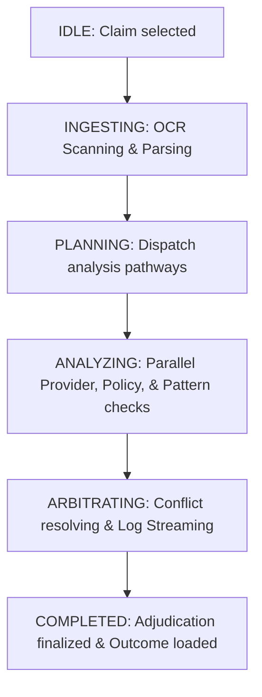

# 🌐 Server-Sent Events (SSE) Event Contracts
### *Single Source of Truth for Frontend-Backend Communication*

This document defines the strict, unified event schema, lifecycles, and payload contracts for Server-Sent Events (SSE) streaming communication between the **Nexus AI Operations Platform** backend and frontend.

---

## 🔄 1. Lifecycle Workflows

### A. Mission Lifecycle
A "Mission" represents a single, complete execution run adjudicating an expense claim:
`IDLE` ➔ `INGESTING` ➔ `PLANNING` ➔ `ANALYZING` ➔ `ARBITRATING` ➔ `COMPLETED`



### B. Event Lifecycle
Events stream over SSE sequentially to report checkpoint transitions, status modifications, and monospaced console log streams:

1. **Workflow Initializing**: `workflow_started`
2. **Document OCR Intake**: `intake_started` ➔ `extraction_completed`
3. **Planner Setup & Routing**: `planner_started` ➔ `planner_dispatch`
4. **Parallel Agent Execution**:
   - *Provider*: `provider_started` ➔ `provider_completed`
   - *Policy Check*: `policy_started` ➔ `policy_completed`
   - *Pattern Check*: `pattern_started` ➔ `pattern_completed`
5. **Conflict Resolution & Arbitration**: `conflict_detected` ➔ `arbiter_started` ➔ `arbiter_completed`
6. **Guardrails & Gates**: `gate_check` ➔ `human_required`
7. **Conclusion & Output**: `decision` ➔ `workflow_completed`

---

## 📡 2. Server-Sent Events (SSE) Stream Format

All SSE packets must comply with the HTML5 event-stream standard. Messages are streamed on UTF-8 text connections, utilizing double-newline delimiters:

```http
event: message
data: {"event_id": "893fa912-429a-4c22-9214-e0c406cb46f0", "mission_id": "RUN-9012", "event_type": "workflow_started", "agent": null, "status": null, "title": "Workflow Initialized", "message": "Nexus AI Operations Platform orchestration session initialized", "severity": "INFO", "confidence": null, "latency_ms": 120, "tools_used": [], "timestamp": "2026-07-11T12:00:00Z", "metadata": {}}
```

---

## 🏷️ 3. Enumerated Values Boundaries

### A. AI Agent Names
- `PlannerAgent`: The central router dispatcher.
- `ProviderAgent`: Validates provider credentials, GSTIN registration, and license scopes.
- `PolicyAgent`: Compares claims against insurance guidelines or enterprise corporate limits.
- `PatternAgent`: Runs fraud audits, duplicates scanner, and historic pattern matching.
- `ArbiterAgent`: Resolves boundary unresolvable conflicts and compiles the terminal logs.

### B. Agent/Workflow Statuses
- `idle`: Awaiting processing triggers.
- `loading`: Active processing/analyzing.
- `success`: Cleared, validated, or verified without flags.
- `warning`: Mild conflict or boundary warning flags found.
- `pending`: Requires secondary context evaluation or human gates.
- `error`: High-risk failure, invalid verification, or duplicate match.

### C. Severity Status Colors
- `INFO`: Neutral informational logging (Blue accent).
- `SUCCESS`: Complete validation clearing (Green accent).
- `WARN`: Warning anomalies detected (Amber/Orange accent).
- `ERROR`: High-risk or failed validations (Red accent).

---

## 📝 4. Canonical JSON Event Schema

Every single event dispatched over the SSE stream **must** conform to the following unified, canonical JSON Schema:

```json
{
  "$schema": "https://json-schema.org/draft/2020-12/schema",
  "title": "NexusAIEvent",
  "description": "Unified flat event contract representing any real-time SSE packet.",
  "type": "object",
  "properties": {
    "event_id": {
      "type": "string",
      "format": "uuid",
      "description": "Unique UUID matching this specific event packet."
    },
    "mission_id": {
      "type": "string",
      "description": "Unique alphanumeric tracking run ID (e.g., RUN-4012)."
    },
    "event_type": {
      "type": "string",
      "enum": [
        "workflow_started",
        "intake_started",
        "extraction_completed",
        "planner_started",
        "planner_dispatch",
        "provider_started",
        "provider_completed",
        "policy_started",
        "policy_completed",
        "pattern_started",
        "pattern_completed",
        "conflict_detected",
        "arbiter_started",
        "arbiter_completed",
        "gate_check",
        "human_required",
        "decision",
        "workflow_completed"
      ],
      "description": "The specific event checkpoint label."
    },
    "agent": {
      "type": ["string", "null"],
      "enum": ["PlannerAgent", "ProviderAgent", "PolicyAgent", "PatternAgent", "ArbiterAgent", null],
      "description": "The executing agent name."
    },
    "status": {
      "type": ["string", "null"],
      "enum": ["idle", "loading", "success", "warning", "pending", "error", null],
      "description": "Active execution status of the agent."
    },
    "title": {
      "type": "string",
      "description": "Short heading label of the event checkpoint."
    },
    "message": {
      "type": "string",
      "description": "Verbose log or message description."
    },
    "severity": {
      "type": "string",
      "enum": ["INFO", "SUCCESS", "WARN", "ERROR"],
      "description": "Log severity mapping."
    },
    "confidence": {
      "type": ["integer", "null"],
      "minimum": 0,
      "maximum": 100,
      "description": "Percentage representing AI accuracy confidence if applicable."
    },
    "latency_ms": {
      "type": ["integer", "null"],
      "minimum": 0,
      "description": "Execution latency metric."
    },
    "tools_used": {
      "type": "array",
      "items": { "type": "string" },
      "description": "List of platform tools executed."
    },
    "timestamp": {
      "type": "string",
      "format": "date-time",
      "description": "ISO 8601 formatted datetime UTC stamp."
    },
    "metadata": {
      "type": "object",
      "description": "Custom dictionary holding additional contextual event fields."
    }
  },
  "required": [
    "event_id",
    "mission_id",
    "event_type",
    "agent",
    "status",
    "title",
    "message",
    "severity",
    "confidence",
    "latency_ms",
    "tools_used",
    "timestamp",
    "metadata"
  ]
}
```
