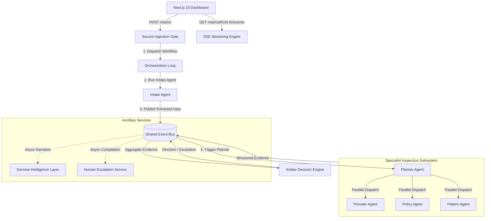

# Nexus AI Operations Platform - Architecture Specification

This document details the architectural topology, communication contracts, and production deployment blueprint of the **Nexus AI Operations Platform**, a high-fidelity, real-time, event-driven multi-agent expense adjudication engine.

---

## 1. Architectural Topology

Nexus AI is engineered with a strict **event-driven architecture (EDA)** utilizing **Server-Sent Events (SSE)** for asynchronous, unidirectional state streaming from the backend directly to the React dashboard.



---

## 2. Core Components

### 2.1 Backend Platform (FastAPI)
The backend is built using **FastAPI** (Python 3.12) running under an asynchronous ASGI event loop.
- **`app/main.py`**: Web-service bootstrap registering routing gates, contextual tracing middleware, sliding rate-limit guards, and global exception boundaries.
- **`app/core/event_bus.py`**: Thread-safe in-memory event publisher implementing the Publish-Subscribe pattern, routing agent events dynamically.
- **`app/core/middleware.py`**: Implements contextual request tracing and IP-based sliding window rate-limiting to secure API entry points.

### 2.2 Orchestration & Specialist Agents
Nexus AI organizes execution into a clean **orchestration-specialist dichotomy** using structured prompt engineering over Google Gemini model pathways:
1. **Intake Agent**: Standardizes raw unstructured claim attachments (PDF/Images) into structured claim schemas.
2. **Planner Agent**: Manages the mission lifetime and coordinates parallel execution of specialized sub-workflows.
3. **Provider Verification Agent**: Connects via active MCP interfaces to verify external business credentials and validate invoices.
4. **Policy Agent**: Evaluates company policy limits and reimbursement guidelines.
5. **Pattern Agent**: Runs anomaly detection, historical frequency analysis, and flags behavior profiles.
6. **Arbiter (Decision Engine)**: Evaluates structured findings from all specialists against a strict logical decision boundary. Never thinks independently; acts as a pure, deterministic evidence evaluator.

### 2.3 Gemma Intelligence Layer (Gemma 2 27B)
An independent service utilizing `GEMMA_MODEL` to run deep behavioral summaries, executive explainability, and consistency audits. Placed strictly out-of-band: if Gemma is unavailable, the core workflow completes unimpeded.

### 2.4 Human Escalation Service
Compiles structured multi-agent evidence packages, generates precise reviewer questions, and synthesizes 15-second voice briefs using Gemini TTS whenever a claim is routed to `ESCALATE`.

---

## 3. Data Flow Model

All interactive UI components follow a unidirectional data flow:
```
[Database / In-Memory State] ──> [Event Bus] ➔ [SSE Stream] ➔ [Zustand Client Store] ➔ [React Hooks] ➔ [Framer Motion Render]
```

### Key Architectural Constraints:
- **No Inline Logic**: Components never infer backend state or calculate workflows locally.
- **State Reactive**: The UI is a pure function of events broadcast by the Event Bus, fully satisfying the `shared/events.md` schema.

---

## 4. Production Deployment Blueprint

The infrastructure is designed for high-availability deployment on **Google Cloud Platform (GCP)**:

- **Compute**: Google Cloud Run (Containerized FastAPI service scaled to 2GB memory, 2 CPUs).
- **Relational Storage**: Cloud SQL (PostgreSQL instance for historical claims caching and user configs).
- **Analytics Database**: BigQuery (for long-term multi-agent telemetry and trend analysis).
- **Object Storage**: Cloud Storage (Secure bucket for raw claim PDFs/images with tight IAM roles).
- **Core Orchestration Gateway**: Google AI Studio API for scalable LLM invocation limits.
