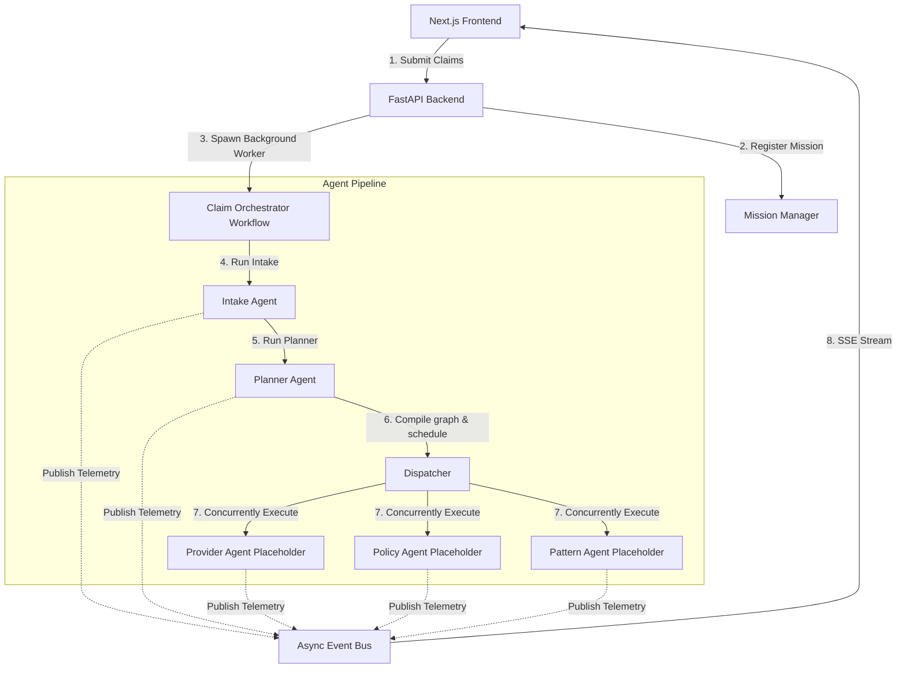

# Nexus AI Operations Platform - Event-Driven Architecture Design

This document describes the event-driven, multi-agent cooperative architecture of the **Nexus AI Operations Platform**.

---

## 🏛️ Architecture Overview

The system is decoupled using a centralized in-memory pub-sub Event Bus. AI Agents communicate solely by dispatching standardized JSON event packets rather than calling other agent modules synchronously.

---

## 🛰️ Modular Execution & Single-Responsibility

To avoid spaghetti asyncio code, the **Planner Agent** splits its responsibilities across four single-responsibility modules under `backend/app/workflow/`:

1. **`graph.py`**: Compiles the logical workflow dependency map. It identifies parallel lanes (such as concurrently running verification checks) and structures them sequentially (e.g. executing parallel checks before handing output to the Arbiter).
2. **`dispatcher.py`**: Schedulers and coordinates tasks. Resolves sequential layers and manages parallel lanes.
3. **`executor.py`**: Executes the actual agent logic. In future stages, executors will invoke live LLM agents; currently, they run placeholder tasks executing appropriate delay times and telemetry outputs.
4. **`planner.py`**: Central decision maker. Uses Gemini to analyze claim facts and dynamically choose which specialist agents to involve.
